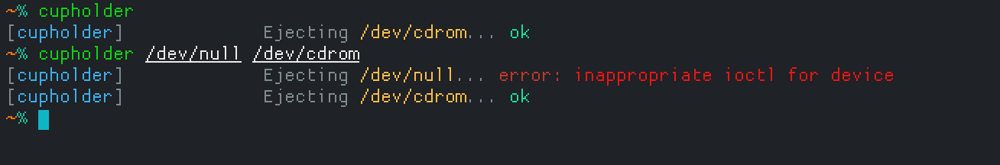
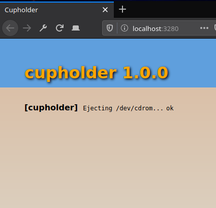

# cupholder   

Eject the CD tray on Linux.

`cupholder` can be useful:

* If you have a large server room with many computers with CD trays, this can be used for finding a specific server.
* If you need an example for how to call `ioctls` from Go without using C.
* If you need an additional tea or coffee cup holder for your desktop.

## Usage

    cupholder

Or when building a project that takes a while, as a notification utility:

    make && cupholder

For specifying a specific device:

    cupholder /dev/cdrom

All arguments are treated as device filenames.

Use `-s` for silent operation and set the `NO_COLOR` environment variable to disable colors.

## Screenshot

## Web server

`cupholder` includes a web server that can be launched with the `-l` or `--listen` flag, that lets you eject the CD remotely, just by visiting the HTTP page at port 3280 (`3280 = 0x0CD0`).

For ejecting the tray using `curl`, a command like this can then be used:

    curl --silent --output /dev/null --write-out '%{http_code}\n' http://localhost:3280/

Replace `localhost` with the hostname or IP address of the server where `cupholder -l` is running.

## Requirements

* Go >= 1.10

## General info

* Version: 1.1.0
* License: GPL2
* Author: Alexander F. Rødseth &lt;xyproto@archlinux.org&gt;
